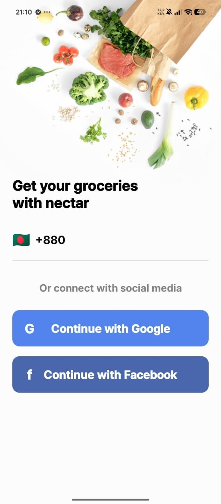
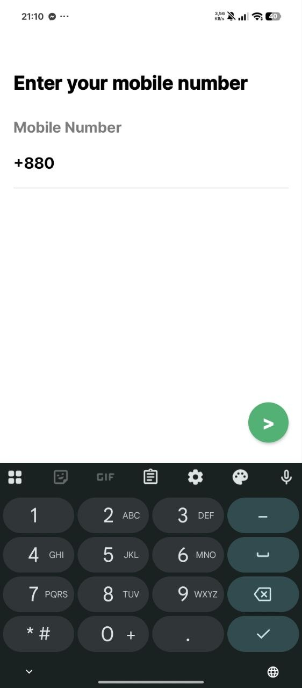
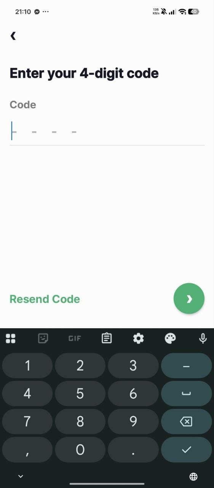
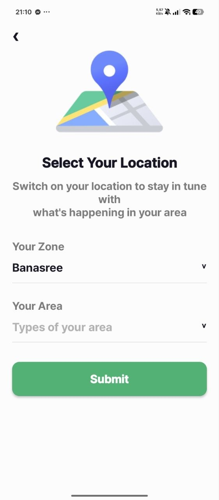
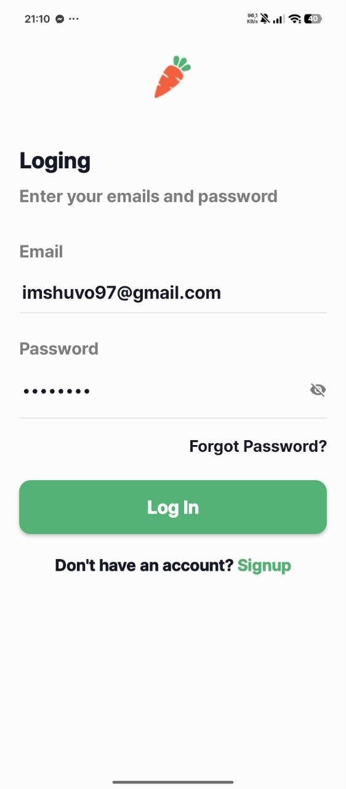
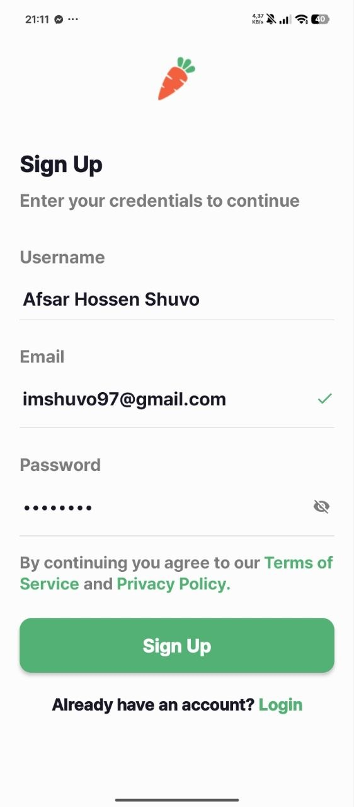
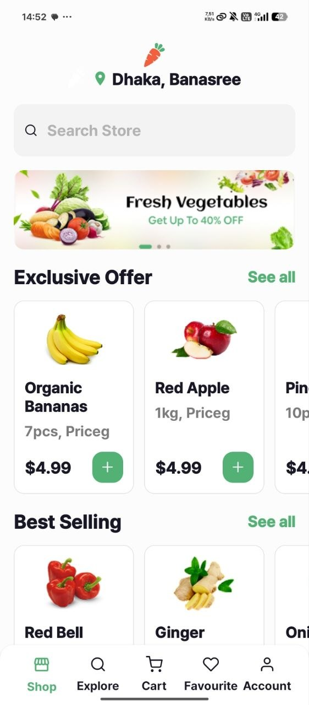
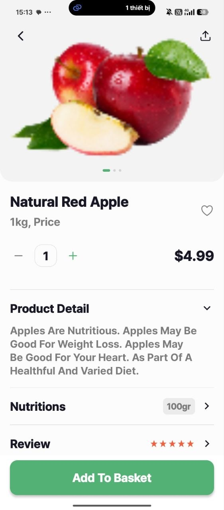
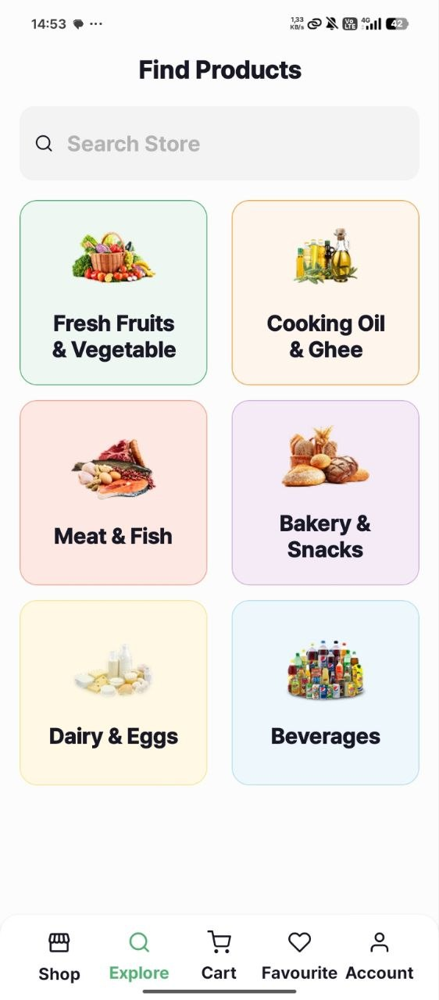
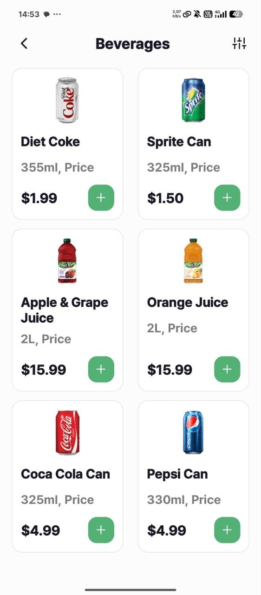

# Bài thực hành 11/4/2026 & 17/4/2026: Nectar App 
## Thông tin sinh viên

* **Họ và tên:** Đỗ Gia Nam
* **MSSV:** 23810310245

## Hướng dẫn cài đặt và chạy ứng dụng

Để chạy được ứng dụng này trên máy của bạn, hãy đảm bảo bạn đã cài đặt sẵn [Node.js](https://nodejs.org/) và ứng dụng **Expo Go** trên điện thoại (hoặc dùng máy ảo Emulator).

**Bước 1: Clone repository về máy**
\`\`\`bash
git clone [https://github.com/dgnaw/Nectar-App.git]
cd NectarApp
\`\`\`

**Bước 2: Cài đặt các thư viện (Dependencies)**
\`\`\`bash
npm install
\`\`\`

**Bước 3: Khởi động máy chủ Expo**
\`\`\`bash
npx expo start

**Bước 4: Chạy ứng dụng**
* **Trên điện thoại:** Mở ứng dụng **Expo Go** (iOS/Android) và quét mã QR hiển thị trên Terminal.
* **Trên máy ảo:** Nhấn phím `a` (để mở Android Emulator) hoặc phím `i` (để mở iOS Simulator) ngay trong Terminal.

---

## Ảnh Demo (Screenshots)

*(Lưu ý: Thêm ảnh chụp màn hình ứng dụng của bạn vào thư mục `demo/` hoặc `assets/` rồi thay thế đường dẫn bên dưới)*

| Splash Screen | Onboarding | Sign In | Number Input |
| :---: | :---: | :---: | :---: |
|  |  |  |  |

| Verification | Select Location | Login | Sign Up |
| :---: | :---: | :---: | :---: |
|  |  |  |  |

---
| Home | Product Detail | Explore | Beverages |
| :---: | :---: | :---: | :---: |
|  |  |  |  |

## Video Demo

**[Click vào đây để xem Video Demo luồng chạy ứng dụng thực tế trên YouTube](https://youtube.com/shorts/85hc23fVNWs)**

*(Do dung lượng của video hơi lớn nên em có up lên youtube và ở trên đây là link video ạ)*
